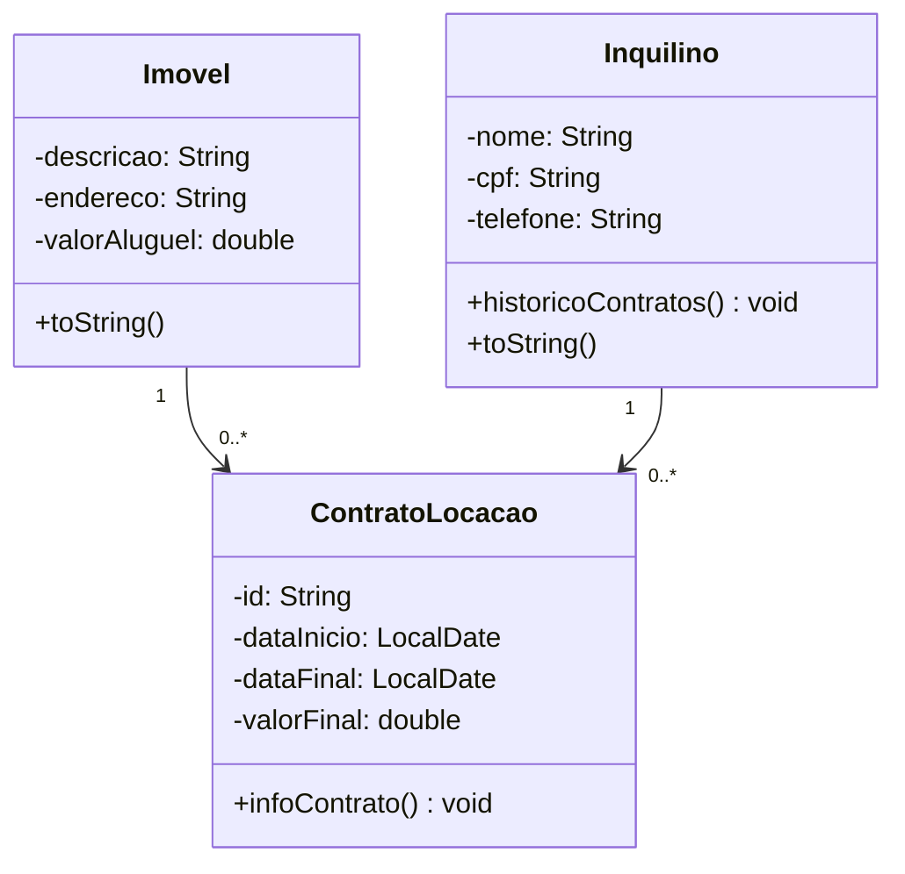

# Atividade 02

# Atividade 03

## 1 - Livro

#### Atributos:
- ISBN
- paginas
- nome
- autor
- dataLancamento

#### Metodos:

- trocarEdicao()
- selecionarCapitulo()
- trocarDePagina()

## 2 - Circulo

#### Atributos:
- cor
- diametro
- material

#### Metodos:

- trocarCor()
- calcularRaio()
- calcularPerimetro()
- trocarMaterial()

## 3 - Filme

#### Atributos:

- nome
- escritor
- diretor
- duracao

#### Metodos:

- musicaAbertura()
- musicaEncerramento()
- atores()

## 4 - Pessoa:

#### Atributos:

- nome
- cpf
- altura

#### Metodos:

- marcaDaCalca()
- estiloRoupa()
- correr()
- agachar()

## 5 - Aluno

#### Atributos:

- nome
- matricula
- idade

#### Metodos:

- estudar()
- fazerRecuperacao()
- tirarDuvida()

## 6 - Item de estoque

#### Atributos:

- marca
- preco
- id
- cor

#### Metodos:

- adicionarDesconto()
- vender()
- aumentarPreco()

## 7 - Conta bancaria

#### Atributos:

- cpf
- saldo
- banco
- chavePix

#### Metodos:

- transferencia()
- emprestimo()
- saque()

### Para consultar os dados, basta adicionar um "toString()" ou um "getAtributoDesejado" nos métodos.
